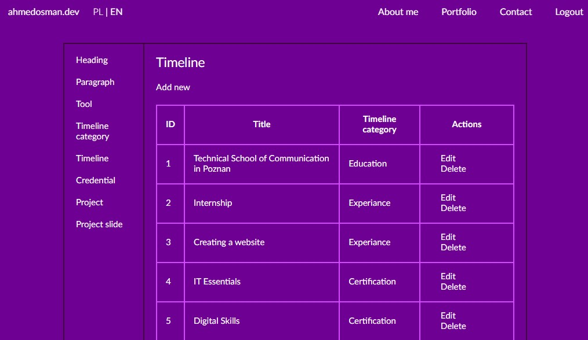

# ahmedosman.dev
My personal site  

## About
This project is developed using Symfony 6.  
In this website most of the sections are created using  <a href="https://github.com/KnpLabs/DoctrineBehaviors/blob/master/docs/translatable.md">Doctrine Behaviors</a> for translations.
All the translatable content can be edited depending on the language locale (e.g. /pl/ or /en/ in URL). It is managed by an admin dashboard presented below.  

## Technologies used
- Symfony 6
- SCSS
- jQuery

## Link
<a href="https://ahmedosman.dev">ahmedosman.dev</a>